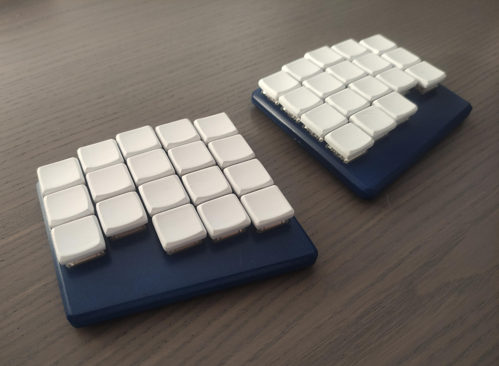

# Borne V1 Keyboard



V2 interest check is now live: https://www.reddit.com/r/mechmarket/comments/10xzn65/ic_borne_v2_a_slim_wireless_and_split_keyboard/

Source files for the Borne Keyboard; a wireless, split, 36-key, orthogonal keyboard with a comparatively large battery capacity that should last over two months.
Also of low profile at a max height of about 17 mm (0.67 in).
Ready-made ZMK and Adafruit nrf52 bootloader binaries are placed in the `firmware/builds` directory.

Currently rocking this keyboard layout: http://www.keyboard-layout-editor.com/#/gists/0e81bf405ebbc268280f0506f7d0e771

**PLEASE NOTE THAT V1 IS A WORKING PROOF OF CONCEPT. Don't copy this project mindlessly and expect everything to work out of the box. I have notes containing over 500 points of improvements or cautions when working on this project, many of which to be added as repo issues in the near future.**

Kicad 6 and its component libraries are required to properly explore the majority of electronic design files. 

https://www.kicad.org/libraries/download/

Arch users simply install `kicad-library` and `kicad-library-3d-nightly` from the official repository.

# Customizing the keymap with ZMK

Necessary ZMK know-how can be found in its official documentation or in its welcoming community discord server: 

https://zmk.dev/docs

https://zmk.dev/community/discord/invite

## Building with GitHub Actions

Allows for keymap customizations to be done without going through the hassle of installing the respective toolchains. It works by automating firmware builds on a cloud server upon repository changes.

#### Repo setup (only once)
Log in/sign up to a personal GitHub account.
Fork https://github.com/gibbz00/borne-zmk-config
#### Keymap updates
Edit `config/borne.keymap`.
Commit and push changes to your personal repo.
#### Retrieving firmware images
In the browser; navigate to "Actions".
Select the latest workflow run.
A "firmware" artifact should appear if all went well, clicking on it should start a zip download, unzip it once completed.
#### Flashing the keyboard
Only the left shield/half/side needs to be built to update the keymap.
Connect the half over USB, put it in bootloader mode (double press reset), and make sure the device storage is mounted. 
Last step is to copy over the `borne_left-borne-zmk.uf2` file to the new USB storage device and wait until the blue LED stops blinking rapidly.

## Local builds and flashing

### Preparations

The following dependencies are required to build ZMK:
* zephyr-sdk 
* python-jsonschema
* remarshal

And for the Adafruit nRF52 bootloader:
* arm-none-eabi-gcc
* python-intelhex

For Arch Linux based distributions: All packages exist in the same name on AUR, e.g:
```
yay -S --needed python-intelhex arm-none-eabi-gcc zephyr-sdk python-jsonschema remarshal 
```

Bootloader and ZMK exist as submodules in this repository. (Not yet merged upstream.)
```
git clone URL && git submodule update
```

All firmware files unique to this keyboard are found in:
```
firmware/Adafruit_nRF52_Bootloader/src/boards/borne_keyboard/
firmware/zmk/app/boards/arm/borne-keyboard/
firmware/zmk/app/boards/shields/borne-keyboard/
```

Those only interested in updating the keymap need not look any further than:
```
firmware/zmk/app/boards/shields/borne-keyboard/borne.keymap
```

### Building ZMK

Only the left shield/half/side needs to be built to update the keymap:
```
# in the firmware/zmk/app directory
west build -d build/left --pristine --board borne -- -DSHIELD=borne_left
```
### Flashing ZMK
Connect the half over USB, put it in bootloader mode (double press reset), and make sure the device storage is mounted. Then:
```
# still in the firmware/zmk/app directory
cp build/left/zephyr/zmk.uf2 path_to_borne_mass_storage/CURRENT.uf2
```

If necessary, change the occurrences of "left" to "right" to build the other half. 

### Adafruit nrf52 bootloader

Multiple ways of building and then flashing the boards over UART is explained in Joric's diligent write-up: https://github.com/joric/nrfmicro/wiki/Bootloader

I only got flashing with OpenOCD on the Raspberry Pi 4 to work.
The hardware specific `openocd.cfg` is found in the `firmware` directory.
Additional resources on how to flash the nrf5240 with OpenOCD and a Raspberry Pi 4 are found at: https://www.rototron.info/circuitpython-nrf52840-dongle-openocd-pi-tutorial/
